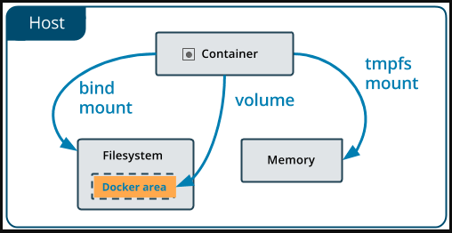
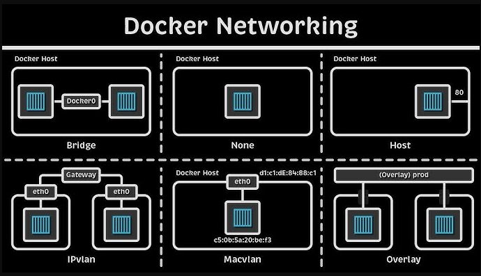

# Guía de Comandos Docker: Volúmenes y Redes

Este README explica el manejo de **volúmenes** y **redes** en Docker, proporcionando contexto y ejemplos prácticos.

---

## Volúmenes en Docker

Los volúmenes permiten persistir datos generados y usados por los contenedores. Son la forma recomendada de almacenar datos en Docker, ya que son gestionados por Docker y pueden ser compartidos entre contenedores.

### Diagrama de Volúmenes

### Comandos y Explicaciones

- `docker volume ls`
  - Lista todos los volúmenes existentes en el sistema Docker.

- `docker volume create nombreCarpeta`
  - Crea un nuevo volumen llamado `nombreCarpeta`.

- `docker run -v nombreVolumen:/directorioDestino -d imagen`
  - Ejecuta un contenedor montando el volumen `nombreVolumen` en la ruta `/directorioDestino` dentro del contenedor.

- `touch db.txt keys.yaml`
  - Crea archivos de ejemplo que pueden ser almacenados en el volumen.

- `docker volume inspect mi_volumen`
  - Muestra detalles sobre el volumen `mi_volumen`, como su ubicación en el host y los contenedores que lo usan.

- `docker exec -it idCONtenedor sh`
  - Permite acceder a la terminal del contenedor para inspeccionar los datos almacenados en el volumen.

- `docker volume rm mi_volumen`
  - Elimina el volumen `mi_volumen` (debe estar sin uso).

- `docker volume prune`
  - Elimina todos los volúmenes no utilizados.

#### Bind Mount (Volumen Personalizado)

- `docker run -v ~/Escritorio/mi_carpeta:/datos CONTENEDOR`
  - Monta una carpeta local (`~/Escritorio/mi_carpeta`) en el contenedor en `/datos`.

- `chmod 777 ~/Escritorio/mi_carpeta`
  - Da permisos completos a la carpeta local para evitar problemas de acceso desde el contenedor.

#### Volumen tmpfs (en memoria)

- `docker run -d --name container-tmfs --tmpfs /data alpine`
  - Crea un contenedor con un volumen temporal en memoria (`tmpfs`) montado en `/data`. Ideal para datos temporales o sensibles.

---

## Redes en Docker

Las redes permiten la comunicación entre contenedores y con el exterior. Docker ofrece varios drivers de red:

### Diagrama de Redes

### Bridge por Defecto

- `docker run -d -it --name cont1 alpine ash`
  - Crea un contenedor usando la red bridge por defecto.

- `sudo docker network inspect bridge`
  - Muestra detalles de la red bridge por defecto.

- `docker exec -it server-py1 sh`
  - Accede a la terminal de un contenedor para probar conectividad.

- `ping -c 3 IP` y `ping -c 3 nombre_contenedor`
  - Prueba la conectividad entre contenedores usando IP o nombre.

### Bridge Personalizada

Permite crear una red bridge propia para aislar y controlar mejor la comunicación entre contenedores. En este caso, se usó la app de Python (`py-app`).

- `docker network ls`
  - Lista todas las redes disponibles.

- `docker network create brigde_personal`
  - Crea una red bridge personalizada llamada `brigde_personal`.

- `docker volume rm red`
  - Elimina un volumen llamado `red` (posible error de nombre, no afecta la red).

- `sudo docker run -d -p 5001:5000 --name app1 --network personal py-app`
  - Ejecuta la app Python en un contenedor llamado `app1`, conectado a la red personalizada y mapeando el puerto 5000 del contenedor al 5001 del host.

- `sudo docker run -d -p 5002:5000 --name app2 --network personal py-app`
  - Similar al anterior, pero mapeando al puerto 5002.

- `sudo docker network inspect bridge`
  - Inspecciona la red bridge (debería inspeccionarse la red personalizada para ver los contenedores conectados).

- `docker exec -it app1 sh`
  - Accede a la terminal de `app1`.

- `curl app2:8000/info`
  - Desde `app1`, consulta el endpoint `/info` de `app2` usando su nombre de red.

### Host

- `sudo docker run -d --name myapp --network host python`
  - El contenedor comparte la red del host, accediendo directamente a los puertos del sistema.

- `curl 192.168.1.45:8000/info`
  - Accede al servicio expuesto por el contenedor usando la IP del host.

### None

- `sudo docker run -d --name myapp --network none python`
  - El contenedor no tiene acceso a ninguna red, completamente aislado.

---

## Resumen

- **Volúmenes**: Persisten datos, pueden ser gestionados por Docker (volúmenes) o por el usuario (bind mounts).
- **Redes**: Permiten la comunicación entre contenedores, con opciones de aislamiento y personalización.

Este archivo sirve como referencia rápida para gestionar almacenamiento y redes en Docker, facilitando el desarrollo y despliegue de aplicaciones como la app de Python mencionada en los ejemplos.
